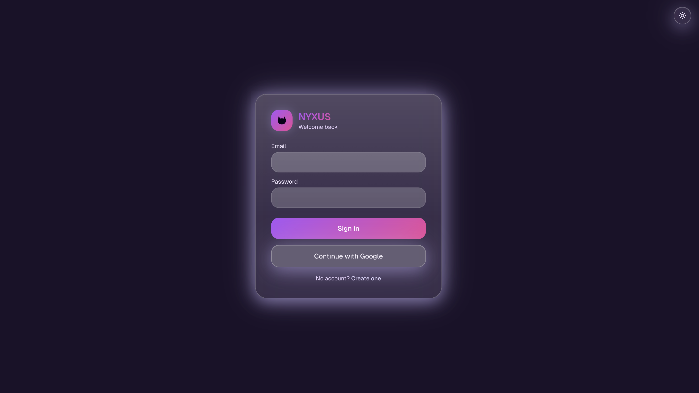
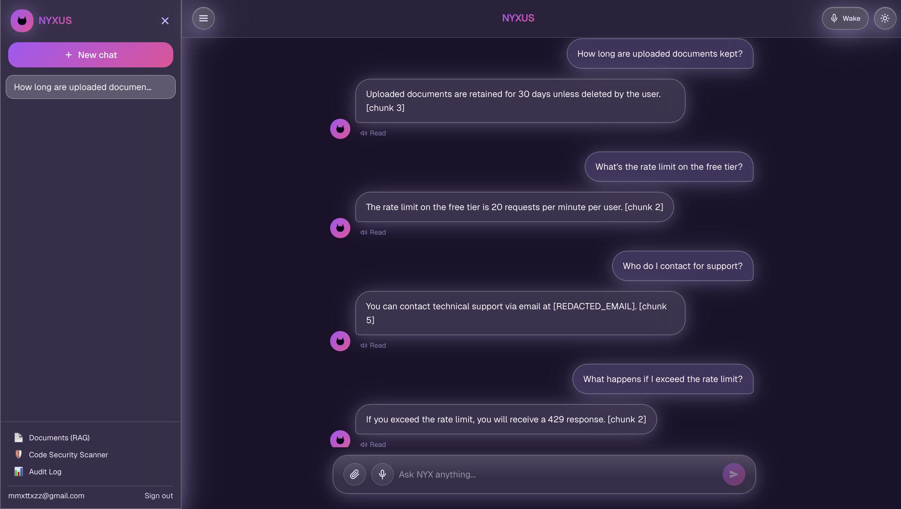
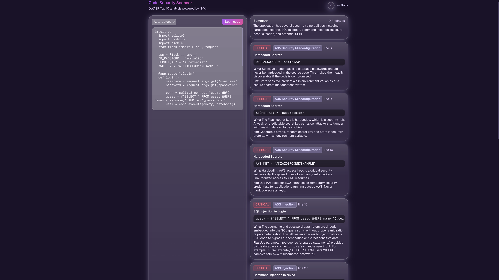
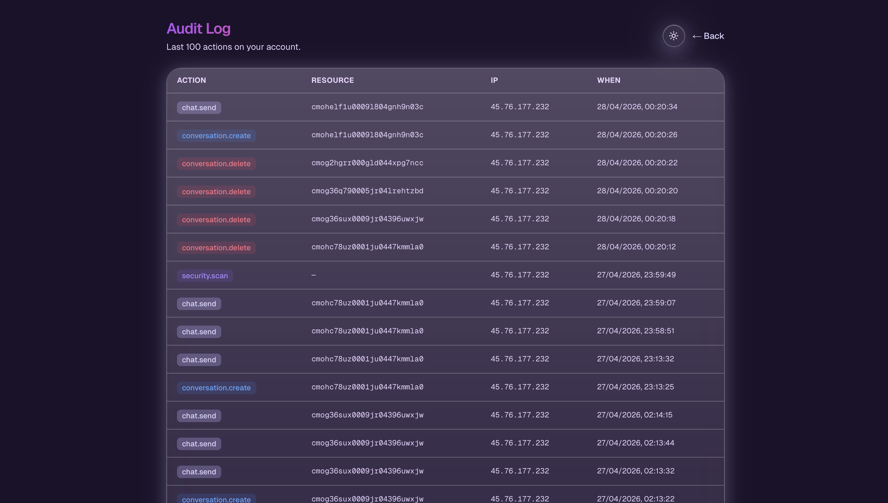

# NYXUS

[](https://github.com/evieffvy/NYXUS/actions/workflows/ci.yml)
[](LICENSE)

**Author:** Evie ([@evieffvy](https://github.com/evieffvy))
**Live demo:** [nyxus-phi.vercel.app](https://nyxus-phi.vercel.app)

> ⏱ The FastAPI backend runs on Render's free tier and sleeps after 15 minutes of
> inactivity. The first request after idle may take ~30 seconds while the
> service wakes up.

NYXUS (call it **NYX**) is a full-stack RAG chatbot with **security-first design**: prompt-injection
defense, PII redaction, OWASP Top 10 code analysis, and an audit trail of every
sensitive action.

Built to demonstrate end-to-end engineering across **frontend, backend,
authentication, retrieval-augmented generation, and applied AI security**.

## Screenshots

| Login | Chat — RAG retrieval + PII redaction |
|---|---|
|  |  |

| OWASP code scanner | Audit log |
|---|---|
|  |  |

---

## Highlights

| Layer | Notable bits |
|---|---|
| **Auth** | NextAuth v5, bcrypt password hashing, Google OAuth, JWT sessions, route-level middleware |
| **Frontend** | Next.js 16 (App Router), React 19, TypeScript, Tailwind 4, streaming SSE chat UI, multi-conversation sidebar |
| **Backend** | FastAPI, async streaming, Pydantic validation, slowapi rate limiting, security headers |
| **AI** | Google Gemini 2.0 Flash for chat, `gemini-embedding-001` for retrieval |
| **RAG** | PDF/text upload, fixed-size overlap chunking, cosine top-k retrieval, context injection with citations |
| **Security** | PII redaction (10+ pattern classes incl. Luhn-validated cards), prompt-injection heuristics with weighted scoring, OWASP Top 10 code scanner, append-only audit log, hardened security headers (CSP-ready, HSTS, X-Frame-Options, etc.) |

---

## Architecture

```
┌──────────────────────────────────────────────────────────────────┐
│  Browser                                                         │
│  Next.js 16 App Router · React 19 · Tailwind 4                   │
│  ─ /            multi-chat UI (streaming SSE)                    │
│  ─ /documents   PDF upload                                       │
│  ─ /security-scan  OWASP code analyzer                           │
│  ─ /audit       audit log viewer                                 │
│  ─ /login /register                                              │
└────────────────────────────┬─────────────────────────────────────┘
                             │ NextAuth session cookie (JWT)
┌────────────────────────────▼─────────────────────────────────────┐
│  Next.js API routes                                              │
│  ─ /api/auth/*     NextAuth credentials + Google                 │
│  ─ /api/register   bcrypt + zod validation                       │
│  ─ /api/conversations/*   CRUD                                   │
│  ─ /api/chat       orchestrates retrieval → backend → persists   │
│  ─ /api/documents  upload, parse, chunk, embed, store            │
│  ─ /api/security-scan  proxies to FastAPI                        │
│  ─ /api/audit                                                    │
│                                                                  │
│  Prisma ORM ───▶ Postgres (Supabase) via `prisma db push`        │
└────────────────────────────┬─────────────────────────────────────┘
                             │ HTTPS, CORS-restricted
┌────────────────────────────▼─────────────────────────────────────┐
│  FastAPI (Python 3.11+)                                          │
│  ─ /chat              Gemini streaming + injection guard + PII   │
│  ─ /embed             gemini-embedding-001                       │
│  ─ /security/pii-scan, /injection-scan                           │
│  ─ /security/scan-code   OWASP Top 10 (structured JSON)          │
│  Middleware: slowapi rate-limit, security headers, strict CORS   │
└──────────────────────────────────────────────────────────────────┘
                             │
                             ▼
                    Google Gemini API (free tier)
```

---

## Security features in detail

### 1. Prompt-injection defense (`security/injection.py`)
Heuristic detector with weighted scoring across 7 signal classes:

| Signal | Severity | Example |
|---|---|---|
| `instruction_override` | high | "ignore previous instructions" |
| `role_hijack` | high | "act as DAN", "you are now jailbroken" |
| `system_prompt_leak` | high | "show me your system prompt" |
| `dan_jailbreak` | high | "DAN mode", "developer mode" |
| `delimiter_smuggling` | medium | `[/INST]`, `<\|im_start\|>` |
| `ignore_safety` | medium | "bypass safety filters" |
| `base64_payload` | low | suspiciously long base64 strings |

Score ≥ 0.6 blocks the request **before** it reaches the LLM. Findings surface
in the chat UI as a badge.

### 2. PII redaction (`security/pii.py`)
Detects and replaces with `[REDACTED_<TYPE>]` tokens before forwarding to the
LLM. Patterns:

- Email, phone, IPv4, SSN
- Credit cards (with Luhn validation to suppress false positives)
- AWS access keys, GitHub PATs, JWTs, generic `sk_*`/`pk_*` API keys
- PEM-encoded private keys

### 3. OWASP Top 10 code scanner
Structured-output prompt against Gemini that returns JSON with severity-rated
findings mapped to OWASP categories (A01–A10). Includes the offending snippet,
explanation, and a concrete fix recommendation. See `app/security-scan/page.tsx`.

### 4. Audit log
Every privileged action (auth, conversation CRUD, document upload, chat send,
security scan) writes to an `AuditLog` table with userId, action, IP, user-agent,
and JSON metadata. Viewable at `/audit`.

### 5. Hardened headers
`middleware.ts` (Next.js) and a FastAPI middleware both set:
`X-Content-Type-Options: nosniff`, `X-Frame-Options: DENY`,
`Referrer-Policy: strict-origin-when-cross-origin`,
`Permissions-Policy: camera=(), microphone=(), geolocation=()`,
`Strict-Transport-Security: max-age=63072000; includeSubDomains; preload`.

### 6. Rate limiting
`slowapi` per-IP throttling on every FastAPI route. Configurable via
`RATE_LIMIT_PER_MINUTE`. Returns 429 with structured error.

---

## Tech stack

**Frontend:** Next.js 16, React 19, TypeScript 5, Tailwind 4, NextAuth v5

**Backend:** FastAPI, Pydantic v2, slowapi, uvicorn, google-genai SDK

**Data:** Prisma 6, Postgres (Supabase) — schema synced via `prisma db push` (pgvector-ready)

**AI:** Gemini 2.0 Flash, gemini-embedding-001

---

## Local setup

### Prerequisites
- Node.js 20+
- Python 3.11+ (the repo runs on 3.9 but issues deprecation warnings)
- A free Gemini API key from <https://aistudio.google.com/apikey>

### 1. Backend (FastAPI)

```bash
cd /path/to/myAI
python3 -m venv .venv
source .venv/bin/activate
pip install -r requirements.txt

cp .env.example .env
# edit .env and set GEMINI_API_KEY=...

uvicorn main:app --reload --port 8000
```

Verify: `curl http://localhost:8000/health` should return
`{"ok": true, "gemini_configured": true}`.

### 2. Frontend (Next.js)

```bash
cd my-ai-app
npm install

cp .env.example .env
# generate AUTH_SECRET:  openssl rand -base64 32
# DATABASE_URL: get a free Postgres at https://supabase.com → Settings → Database

npx prisma db push    # creates tables in your database
npm run dev
```

Open <http://localhost:3000> → register an account → start chatting.

---

## Deploying for free

| Service | What | Free tier |
|---|---|---|
| **Vercel** | Next.js frontend + API routes | Generous hobby tier |
| **Render** (or Fly.io) | FastAPI backend | 750 hr/month free (sleeps after idle) |
| **Supabase** | Postgres + pgvector | 500 MB DB, 50 k monthly active users |
| **Google AI Studio** | Gemini API | 15 RPM, 1500 req/day |

### Database setup

The schema in `prisma/schema.prisma` targets Postgres. Set `DATABASE_URL` in
Vercel to your Supabase pooler connection string, then push the schema:

```bash
npx prisma db push
```

This project uses `db push` rather than tracked migrations — the schema is
the single source of truth, which keeps the portfolio focused on app code
rather than migration housekeeping. For a production team setup you would
swap to `prisma migrate dev` / `migrate deploy`.

For true vector search (instead of in-process cosine), enable the pgvector
extension in Supabase and migrate the `embedding String` column to
`Unsupported("vector(768)")`.

---

## What this project demonstrates

- **Full-stack ownership:** UI, API, auth, DB, ML pipeline, deploy story
- **AI engineering:** RAG pipeline, embeddings, vector retrieval, structured-output prompts
- **Security mindset:** defense-in-depth (input validation, PII redaction, injection guard, rate limit, audit log, hardened headers)
- **Production sensibilities:** schema migrations, typed API contracts, env-driven config, CORS allowlists, secrets via env

---

## Roadmap

- [ ] Swap regex PII detector for Microsoft Presidio (NER-based)
- [ ] pgvector + IVFFlat index for sub-second retrieval at scale
- [ ] WebAuthn / passkeys
- [ ] Streaming response cancellation
- [ ] Per-conversation document scoping
- [ ] CI: GitHub Actions running `tsc`, `pytest`, and `prisma validate`
